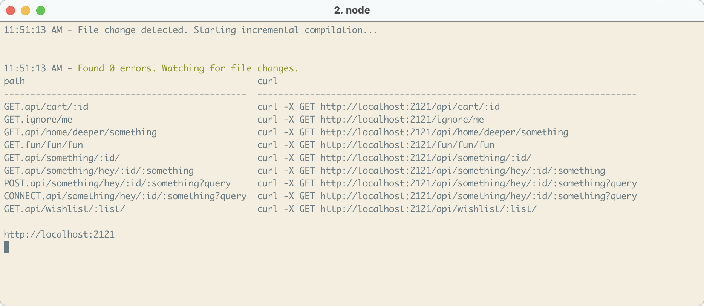

<!--

"express-autoload-router": "^1.0.5",
"expressjs.routes.autoload": "^0.2.0"

https://developpaper.com/typescript-es6-promise-recursively-traverses-files-in-folders/

https://github.com/tranvansang/middleware-async

-- ALIASES
https://www.npmjs.com/package/module-alias

-- APPLY FP-TS TO EXPRESS
https://hvalls.dev/posts/intro-functional-fpts

-- ROLLUP & TYPESCRIPT
https://github.com/alex1504/generator-rollup-tslib-starter
https://github.com/alexjoverm/typescript-library-starter
https://github.com/rollup/rollup-starter-lib
https://github.com/ezolenko/rollup-plugin-typescript2

-- TESTING
https://www.npmjs.com/package/@jest-mock/express

-->



## Why
1. I don't feel that adding express routes manually is a good use of my time.
1. I want to spend time figuring out & debugging why a path isn't being added.
1. Having a common `interface` makes it easy to create
1. The name of the path function isn't important, it's the path
1. The `Route` should be self sufficient and should declare everything it needs itself.
1. I like clean code and this will make things far cleaner.
1. I don't like `try`/`catch` code in my handlers.
    * That should be handled by some wrapping function and I declare my happy path and unhappy path functions
1. Dependencies shouldn't be hard to handle so I'm trying to make that easier.

## Use
Check out `./example` to see more examples

### Simplest setup
Your `app.js`
```ts
try {
  const paths = routesLoader(app, path.join(__dirname, '/some/dir'), true)

  // Do this if you wanna see the output of all the paths.
  console.log()
  console.table(paths)
} catch (error) {
  console.log(error.toString())
}
```

Example `test.route.ts`. This is the minimal configuration needded to get it to be picked up.

Notes: 
* Your file **must** include the `route.ts` at the end. That's how the app finds the routes.
* You can have multiple routes exported in a single file.
    * see: [`test.routes.ts`](./tests/__mocks__/test.routes.ts)
* The `error` handler has the same signature as `run`
* You needn't but it is beneficial to define your dependencies in `Route<T>`
    * see: [`test.routes.ts`](./tests/__mocks__/test.routes.ts#L7) and [`test.routes.ts`](./tests/__mocks__/test.routes.ts#L44)

```ts
export const cart = (): Route<object> => ({
  method: METHOD.GET,
  path: 'some/uri/:id',

  run: async (deps: Dependencies): Promise<JSONResponse> => {
    const { req } = deps // By default Express' req & res are added to deps.

    if (parseInt(req.params.id) == 1) {
      throw new Error('You can use the default error handler or make your own')
    }

    // Always return your JSON, do not need to use res.send
    return {
      origUrl: req.originalUrl
    }
  },
})
```

---
## API
Eventually

## Examples
Single line installer:
```
git clone https://github.com/mrpotatoes/express-autoloader.git; npm i; npm run example
```

To test it out run the `curl` commands that the example outputs and change any `:vars` variables that are needed

## Currently broken things
- I cannot use TS Paths in the config. What's up with that?
- Add in the vscode debugging stuff to make life easier.