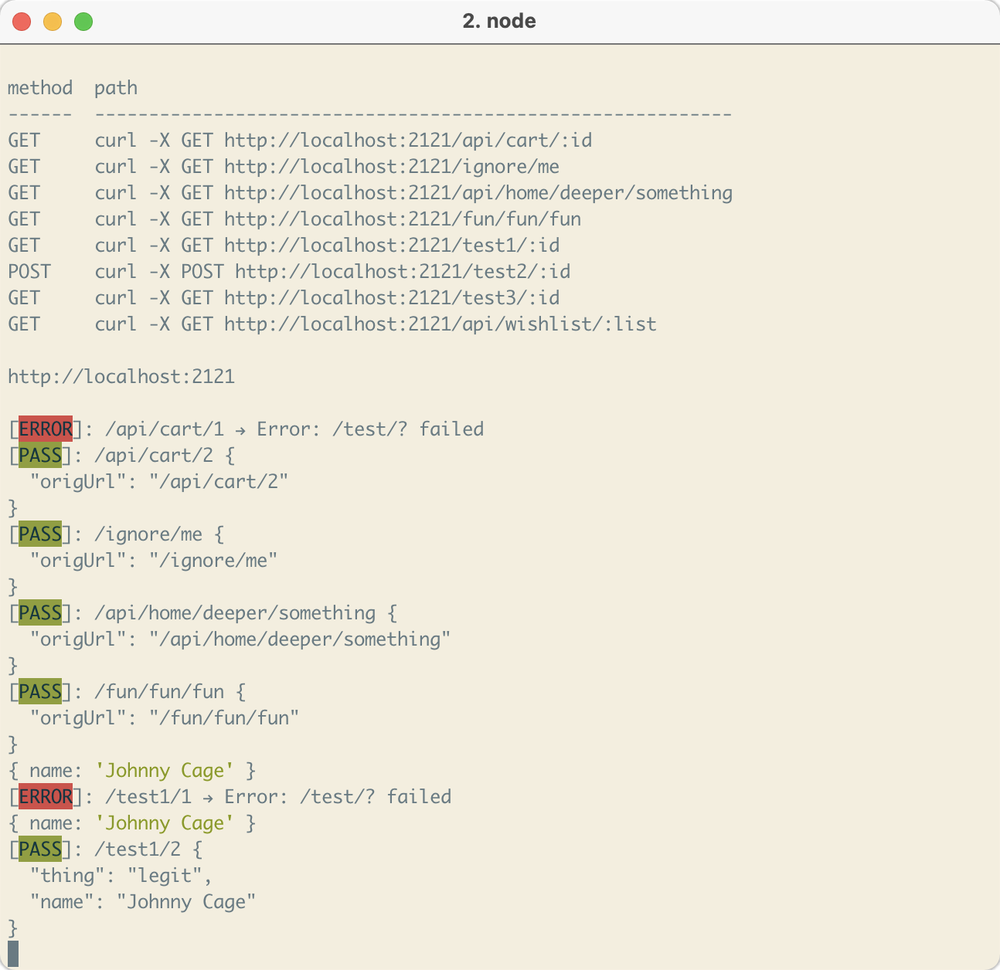

<!--

"express-autoload-router": "^1.0.5",
"expressjs.routes.autoload": "^0.2.0"

https://developpaper.com/typescript-es6-promise-recursively-traverses-files-in-folders/

https://github.com/tranvansang/middleware-async

-- ALIASES
https://www.npmjs.com/package/module-alias

-- APPLY FP-TS TO EXPRESS
https://hvalls.dev/posts/intro-functional-fpts

-- ROLLUP & TYPESCRIPT
https://github.com/alex1504/generator-rollup-tslib-starter
https://github.com/alexjoverm/typescript-library-starter
https://github.com/rollup/rollup-starter-lib
https://github.com/ezolenko/rollup-plugin-typescript2

-- TESTING
https://www.npmjs.com/package/@jest-mock/express

-->



## Why
1. I don't feel that adding express routes manually is a good use of my time.
1. I want to spend time figuring out & debugging why a path isn't being added.
1. Having a common `interface` makes it easy to create
1. The name of the path function isn't important, it's the path
1. The `Route` should be self sufficient and should declare everything it needs itself.
1. I like clean code and this will make things far cleaner.
1. I don't like `try`/`catch` code in my handlers.
    * That should be handled by some wrapping function and I declare my happy path and unhappy path functions
1. Dependencies shouldn't be hard to handle so I'm trying to make that easier.

## Use
```ts

// Pull this in to your handler code to manage your deps better.
// interface Dependencies {
//   req: Request
//   res: Response
// }

// ----------------------------------------------------------------------
// In file /routes/api
interface CustomDependencies extends Dependencies {
  name: string,
}

// Typed deps to know what you're getting.
const someHandler = (deps: CustomDependencies): Promise<JSONResponse> => {
    const { req, res, ...cleanedDeps } = deps

    if (parseInt(req.params.id) == 1) {
      throw new Error('/test/? failed')
    }

  // Always return a JSON object.
    return {
      thing: 'legit',
      ...cleanedDeps,
    }
  },

export const api = () => ({
  method: METHOD.GET,
  path: 'test/:id',
  middlewares: [middleware1, middleware2],
  prodExclude: false, // Set to true so it doesn't come along to prod.
  version: VERSIONS.V1,

  dependencies: {
    name: "Johnny Cage",
  } as CustomDependencies,

  // Your "dooer" function
  run: someHandler,

  // If you want to handle your own errors. Leave out for default.
  error: (deps: CustomDependencies) => ({}),
})

// ----------------------------------------------------------------------
// Some other file
import express from 'express'
import autoloader from '@mrpotatoes/express-autoloader'

// Allow for multiple paths
const paths = [
  path.join(__dirname, '/path/to/routes'),
]

autoloader(express(), paths, true)
```

## Example
Clone this repo, install then run `example:setup`.
Go into `example` and muck around in there.

## Currently broken things
- I cannot use TS Paths in the config. What's up with that?
- Add in the vscode debugging stuff to make life easier.